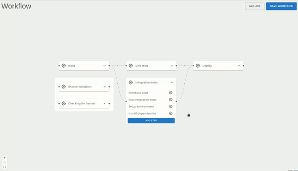

# GitHub Action's Editor

The GitHub Action Editor is a Visual Studio Code extension designed to simplify the creation of GitHub Actions workflows. With this extension, you can visually edit your YAML files for GitHub Actions, making it easier and quicker to build your CI/CD pipeline.

## Usage

1. Install the extension from the [Marketplace](https://marketplace.visualstudio.com/items?itemName=SpencerRobertson.github-action-editor).
2. Open or create a .github/workflows YAML file in your project (See more [here](https://docs.github.com/en/actions/writing-workflows)).
3. Click on the    in the top right corner or run the `Edit Github Action` command.
4. Save your changes and commit them to your repository.

## Features

- **Connect jobs together easily**: You no longer need to remember the ID of the jobs you want to connect, instead you can just drag and drop!

  

 

- **Reorganize steps**: Drag and drop steps to reorder them!

  

## Contributing

We welcome contributions to improve the extension! If you have any suggestions or find any issues, please open an issue on GitHub.

## Support

For support, please visit our GitHub Discussions,

## License

This extension is licensed under the MIT License.
